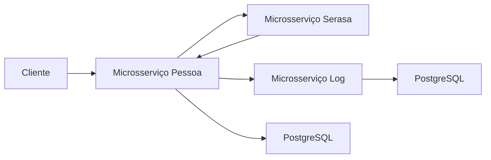

# Microsserviços Spring Boot + Kafka

## 📋 Introdução

Este projeto demonstra uma arquitetura de microsserviços utilizando **Spring Boot** e **Apache Kafka** para comunicação entre serviços. O sistema implementa padrões de mensageria tanto síncronos quanto assíncronos.

### 🏗️ Arquitetura do Sistema

O sistema é composto por **3 microsserviços independentes**:

- **🔸 Microsserviço Pessoa** (Porta 8090) - Gerenciamento CRUD de pessoas
- **🔸 Microsserviço Serasa** (Porta 8070) - Simulação de consultas de negativação  
- **🔸 Microsserviço Log** (Porta 8060) - Sistema de auditoria e logs

### 🚀 Tecnologias Principais

- **Java 21** - Linguagem de programação
- **Spring Boot 3.5+** - Framework principal
- **Apache Kafka** - Mensageria e comunicação entre serviços
- **PostgreSQL** - Banco de dados relacional
- **Flyway** - Migrações de banco de dados
- **Circuit Breaker** - Resilience4j para tolerância a falhas
- **Swagger/OpenAPI** - Documentação da API

### 🔄 Padrões de Comunicação

#### Comunicação Síncrona (Request-Reply)
- Consulta ao Serasa durante cadastro de pessoas
- Timeout configurado e Circuit Breaker ativo
- Fallback em caso de indisponibilidade

#### Comunicação Assíncrona (Fire-and-Forget)  
- Envio de logs de auditoria
- Processamento em background
- Garantia de entrega via acknowledgment

### 📊 Fluxo de Dados

